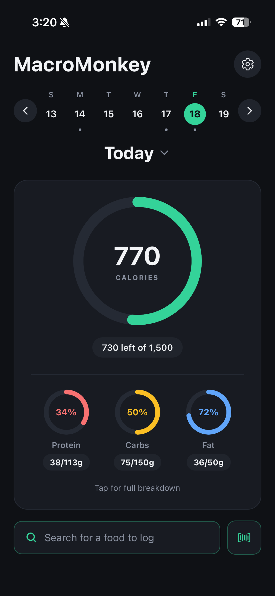
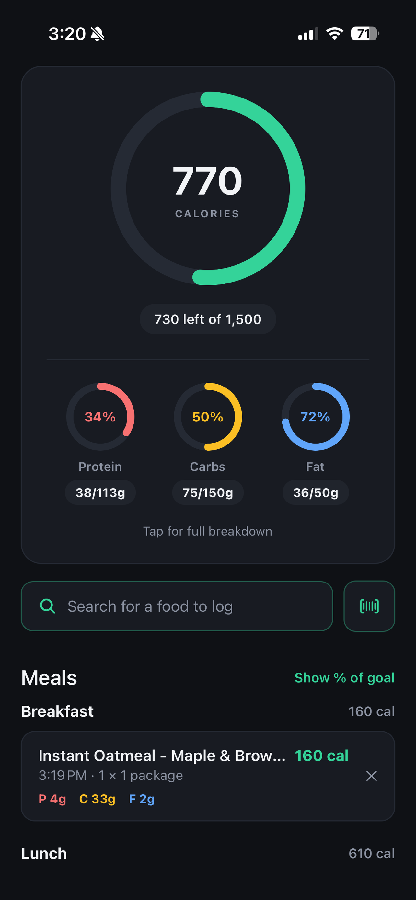
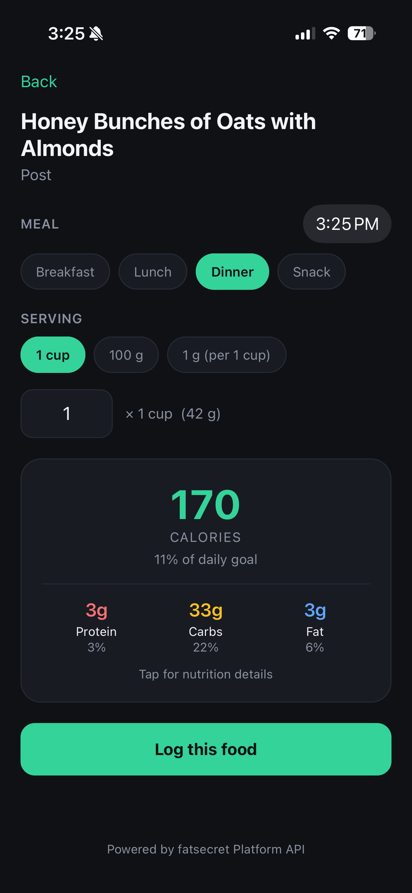
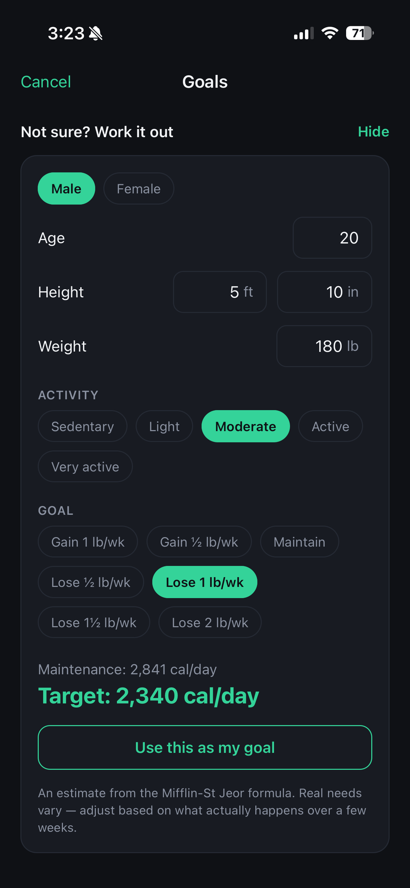

# MacroMonkey

A macronutrient and calorie tracking app for iOS. Search or scan a food, pick
your portion, and track daily intake against personalized goals.

Built with React Native, Expo, TypeScript, and Firebase.

<p align="center">
  
  
  
  
</p>

## Features

- **Accounts and cloud sync** — email/password sign-in via Firebase Auth, with
  every user's data isolated by server-side security rules
- **Food search** — debounced live search against the FatSecret Platform API,
  with autocomplete suggestions
- **Barcode scanning** — point the camera at a package to pull up the food
- **Portion control** — choose any serving the database offers, or enter grams
  directly for weighed food
- **Meals and times** — entries are grouped into breakfast, lunch, dinner and
  snack, each with its own time, editable for planning ahead
- **Daily tracking** — animated progress rings for calories and each macro, a
  meal list that toggles between grams and percentage of goal
- **Full-day breakdown** — actual-vs-target macro split, macro table, biggest
  calorie contributors, and full micronutrient totals
- **Personalized goals** — enter a calorie target directly, or use the built-in
  BMR calculator (Mifflin-St Jeor → maintenance → deficit). Macro percentages
  and grams stay linked in both directions.
- **Any date** — review past days or log ahead to plan meals
- **Account deletion** — in-app, with reauthentication, removing the account and
  all of its data

## Stack

| | |
|---|---|
| Framework | React Native + Expo (SDK 54) |
| Language | TypeScript |
| Navigation | Expo Router (file-based) |
| Auth | Firebase Authentication |
| Database | Cloud Firestore |
| API proxy | Firebase Cloud Functions (2nd gen) |
| Nutrition data | FatSecret Platform API (OAuth 2.0) |
| Graphics | react-native-svg |
| Animation | react-native-reanimated |
| Camera | expo-camera |
| Builds | EAS Build → TestFlight |

## Project structure

```
app/                  Screens — the file path is the route
  _layout.tsx         Auth gate: splash, sign-in, or the app
  index.tsx           Today: rings, meal list, week strip, date navigation
  search.tsx          Live food search with autocomplete
  food/[id].tsx       Food detail — servings, quantity, meal, time, logging
  day.tsx             Full-day breakdown and charts
  settings.tsx        Goals, BMR calculator, sign out, delete account
  scan.tsx            Barcode scanner

lib/                  Logic, isolated from the UI
  foodApi.ts          The only module that talks to the nutrition API
  diary.ts            Logged entries, totals, meals, date handling
  profile.ts          User goals, BMR and macro maths
  auth.ts             Sign up / in / out, error message mapping
  account.ts          Account deletion across auth and database
  firebase.ts         Firebase initialization
  nutrients.ts        Shared micronutrient field table
  colors.ts           Palette
  format.ts           Number formatting
  useCountUp.ts       Counting-number animation hook

components/
  Ring.tsx            Animated SVG progress ring
  SignInScreen.tsx    Sign in / sign up
  FatSecretAttribution.tsx

functions/            Firebase Cloud Functions
  src/index.ts        Authenticated proxy to the FatSecret API
```

## Architecture notes

**The nutrition API is behind one module.** `lib/foodApi.ts` exposes
app-owned `Food` and `Serving` types; no screen ever sees vendor JSON. This has
now been tested three times in practice — the original provider went paid
mid-project and was swapped before any UI existed, a later upgrade from the
API's v1 to v5 endpoints changed the entire response shape, and the move to a
server-side proxy replaced the whole transport. Each one touched exactly this
file. (v1 required parsing macros out of a prose sentence with regular
expressions; v5 returns structured serving data.)

**API credentials never reach the client.** The FatSecret client secret lives in
Google Secret Manager and is used only inside a Cloud Function. The app calls
that function, which requires a valid Firebase ID token, so an unauthenticated
request is rejected before the credentials are touched. The function also builds
every upstream URL itself rather than accepting one from the client, so it can't
be used as an open relay.

This replaced an earlier approach where the secret was inlined into the app
bundle. That's worth naming plainly: `.env` plus `.gitignore` keeps a secret out
of version control, but Expo inlines `EXPO_PUBLIC_` values at build time, and
anything shipped to a device is extractable from it.

**Storage is behind one module too.** `lib/diary.ts` handles all reads and
writes. Entries are keyed by date and store a full snapshot of the nutrition
values at log time rather than a reference to the food — so revisions to the
upstream database can't silently rewrite your history. Migrating from
on-device AsyncStorage to Firestore was a rewrite of that one file.

**Two different kinds of time.** An entry's `date` is the day it counts toward;
its `loggedAt` is when it was (or will be) eaten. They come apart constantly —
recording last night's dinner this morning, or planning tomorrow's lunch — so
keeping them separate means neither has to lie about the other.

**Schema changes are absorbed at the boundary.** Meals were added after entries
already existed. Rather than migrating stored documents, `meal` is optional in
storage and `mealOf()` supplies the fallback, so no screen ever sees a missing
value. Changing that default is a one-line change.

**Derived, not stored.** Totals, percentages, macro targets, meal groupings and
filtered lists are all computed during render from the minimum stored state.
There is no second copy of a total that can drift out of sync with the entries
behind it.

**Missing data is not zero.** Micronutrients the API doesn't report are
`undefined`, so the UI hides those rows rather than claiming a food contains
none. The same distinction separates "not searched yet" from "searched and
found nothing".

## Running it locally

Requires Node, and the Expo Go app on a phone (or an iOS simulator).

```bash
git clone <your-repo-url>
cd MacroMonkey
npm install
```

Because credentials are held server-side, running this yourself means supplying
your own backend rather than dropping keys in a file:

1. Create a Firebase project with Authentication (email/password) and Cloud
   Firestore enabled, and put its config in `lib/firebase.ts`.
2. Get FatSecret Platform API credentials (free tier at
   [platform.fatsecret.com](https://platform.fatsecret.com/)).
3. Deploy the proxy function with those credentials as secrets:

```bash
firebase functions:secrets:set FATSECRET_CLIENT_ID
firebase functions:secrets:set FATSECRET_CLIENT_SECRET
firebase deploy --only functions
```

Then:

```bash
npx expo start
```

Scan the QR code with the Camera app on iOS, with the phone on the same
network as the machine running Metro.

## Known limitations

Deliberate tradeoffs, tracked rather than ignored:

- **Offline state is invisible.** Firestore falls back to its local cache with no
  indication in the UI, so an empty day while offline looks identical to a
  genuinely empty day. A user could re-log food and create duplicates on
  reconnect. Needs a connection indicator and a distinct offline empty state.
- **A network connection is required** for anything not already cached. There is
  no offline-first write queue beyond what Firestore provides by default.
- **Account deletion is client-side and best-effort.** If the connection drops
  mid-deletion, partial state is possible. A Cloud Function triggered on user
  deletion would make the cleanup uninterruptible.
- **The week strip reads every entry in range.** Firestore bills per document
  returned, so a busy week costs more reads than it needs to. A per-day summary
  document would reduce this to seven reads.
- **No custom foods.** You're limited to the servings the database provides,
  so unusual portions can't always be logged precisely.
- **Planned and eaten meals are indistinguishable.** Logging ahead is
  supported, but nothing marks an entry as planned or prompts you to confirm it
  later.
- **English/US units only.** Short date labels and body measurements are
  hardcoded to US conventions.

## Roadmap

- AI-assisted logging — describe a meal in plain language, get an estimate to
  confirm before logging
- Offline indicator and a distinct offline empty state
- Restaurant shortcuts for common chains
- Custom foods and servings
- Weight tracking over time
- Android release

## Attribution

Powered by fatsecret Platform API.
