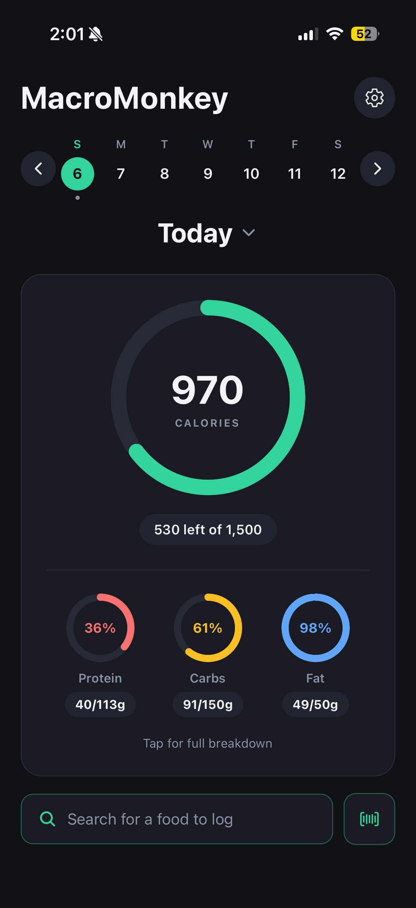
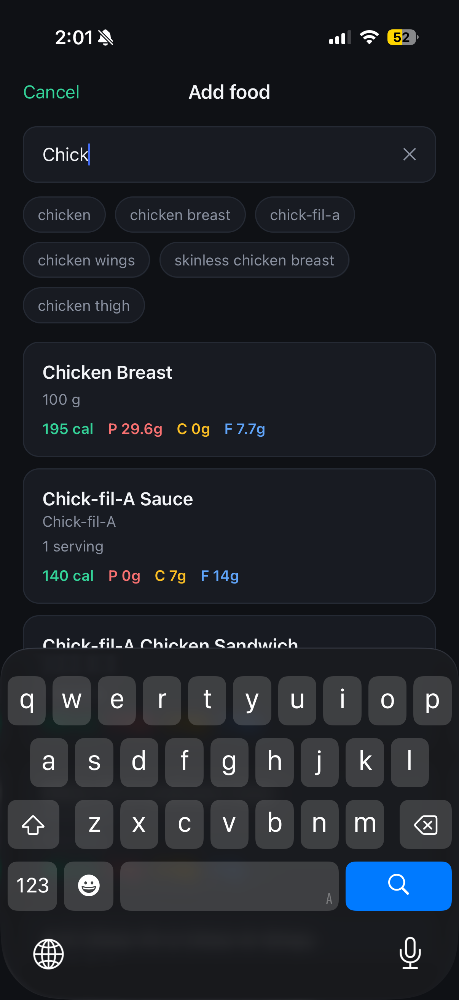
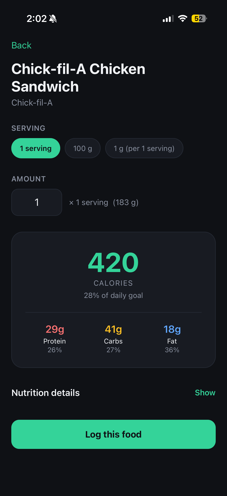
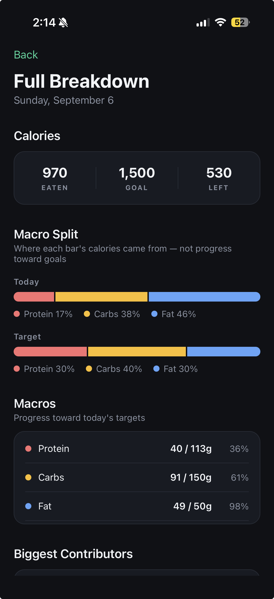

# MacroMonkey

A macronutrient and calorie tracking app for iOS. Search or scan a food, pick
your portion, and track daily intake against personalized goals.

Built with React Native, Expo, and TypeScript.


<p align="center">
  
  
  
  
</p>


## Features

- **Food search** — debounced live search against the FatSecret Platform API,
  with autocomplete suggestions
- **Barcode scanning** — point the camera at a package to pull up the food
- **Portion control** — choose any serving the database offers, or enter grams
  directly for weighed food
- **Daily tracking** — animated progress rings for calories and each macro, a
  meal list that toggles between grams and percentage of goal
- **Full-day breakdown** — actual-vs-target macro split, macro table, biggest
  calorie contributors, and full micronutrient totals
- **Personalized goals** — enter a calorie target directly, or use the built-in
  BMR calculator (Mifflin-St Jeor → maintenance → deficit). Macro percentages
  and grams stay linked in both directions.
- **Any date** — review past days or log ahead to plan meals

## Stack

| | |
|---|---|
| Framework | React Native + Expo (SDK 54) |
| Language | TypeScript |
| Navigation | Expo Router (file-based) |
| Nutrition data | FatSecret Platform API (OAuth 2.0) |
| Storage | AsyncStorage (Firestore migration planned) |
| Graphics | react-native-svg |
| Animation | react-native-reanimated |
| Camera | expo-camera |

## Project structure

```
app/                  Screens — the file path is the route
  index.tsx           Today: rings, meal list, date navigation
  search.tsx          Live food search with autocomplete
  food/[id].tsx       Food detail — servings, quantity, logging, editing
  day.tsx             Full-day breakdown and charts
  settings.tsx        Goals and BMR calculator
  scan.tsx            Barcode scanner

lib/                  Logic, isolated from the UI
  foodApi.ts          The only module that talks to FatSecret
  diary.ts            Logged entries, totals, date handling
  profile.ts          User goals, BMR and macro maths
  nutrients.ts        Shared micronutrient field table
  colors.ts           Palette
  format.ts           Number formatting
  useCountUp.ts       Counting-number animation hook

components/
  Ring.tsx            Animated SVG progress ring
```

## Architecture notes

**The nutrition API is behind one module.** `lib/foodApi.ts` exposes
app-owned `Food` and `Serving` types; no screen ever sees vendor JSON. This
was tested twice in practice — the original provider went paid mid-project and
was swapped before any UI existed, and a later upgrade from the API's v1 to v5
endpoints changed the entire response shape while touching exactly one file.
(v1 required parsing macros out of a prose sentence with regular expressions;
v5 returns structured serving data.)

**Storage is behind one module too.** `lib/diary.ts` handles all reads and
writes. Entries are keyed by date and store a full snapshot of the nutrition
values at log time rather than a reference to the food — so revisions to the
upstream database can't silently rewrite your history. The Firestore migration
is a rewrite of that one file.

**Derived, not stored.** Totals, percentages, macro targets and filtered lists
are all computed during render from the minimum stored state. There is no
second copy of a total that can drift out of sync with the entries behind it.

**Missing data is not zero.** Micronutrients the API doesn't report are
`undefined`, so the UI hides those rows rather than claiming a food contains
none. The same distinction separates "not searched yet" from "searched and
found nothing".

## Running it locally

Requires Node, and the Expo Go app on a phone (or an iOS simulator).

```bash
git clone <your-repo-url>
cd MacroMonkey
npm install
```

Create a `.env` file in the project root with FatSecret Platform API
credentials (free tier available at
[platform.fatsecret.com](https://platform.fatsecret.com/)):

```
EXPO_PUBLIC_FATSECRET_CLIENT_ID=your_client_id
EXPO_PUBLIC_FATSECRET_CLIENT_SECRET=your_client_secret
```

The API restricts requests to whitelisted IP addresses — configure this in the
FatSecret dashboard before running. Then:

```bash
npx expo start
```

Scan the QR code with the Camera app on iOS, with the phone on the same
network as the machine running Metro.

## Known limitations

Deliberate MVP tradeoffs, tracked rather than ignored:

- **No accounts or cloud sync.** Data lives on-device via AsyncStorage.
  Firebase Auth + Firestore are the planned next step.
- **API credentials ship in the bundle.** `.env` keeps them out of version
  control, but Expo inlines them at build time and they're extractable from an
  installed app. The fix is a Cloud Function proxy holding them server-side.
- **Planned and eaten meals are indistinguishable.** Logging ahead is
  supported, but nothing marks an entry as planned or prompts you to confirm it
  later.
- **No custom foods.** You're limited to the servings the database provides,
  so unusual portions can't always be logged precisely.
- **English/US units only.** Short date labels and body measurements are
  hardcoded to US conventions.

## Roadmap

- Firebase Auth and Firestore, with security rules from day one
- Cloud Function proxy for API credentials
- TestFlight distribution
- Custom foods and servings
- Meal grouping (breakfast / lunch / dinner)
- Weight tracking over time

## Attribution

Nutrition data provided by [FatSecret](https://platform.fatsecret.com/).
