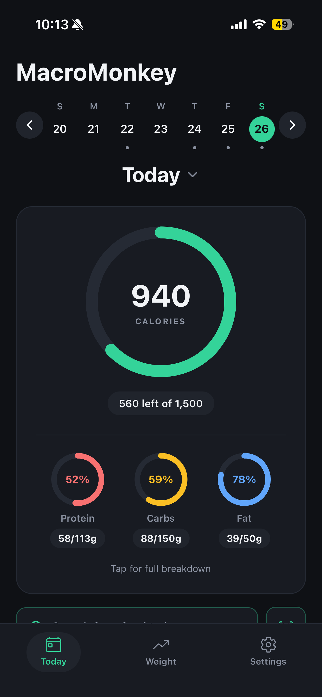
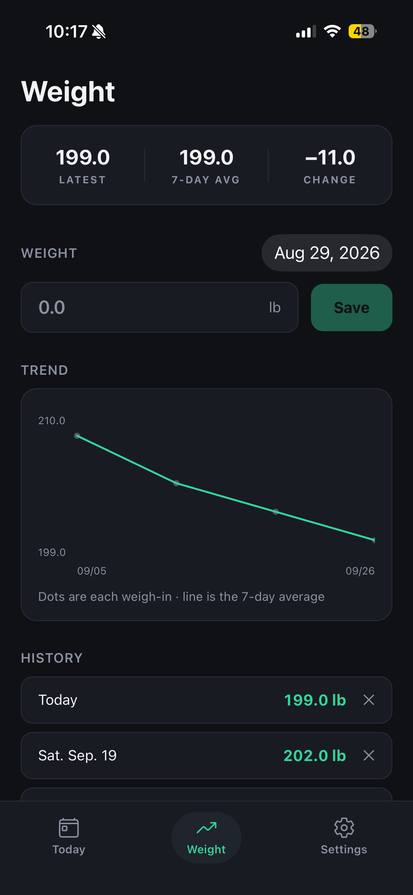
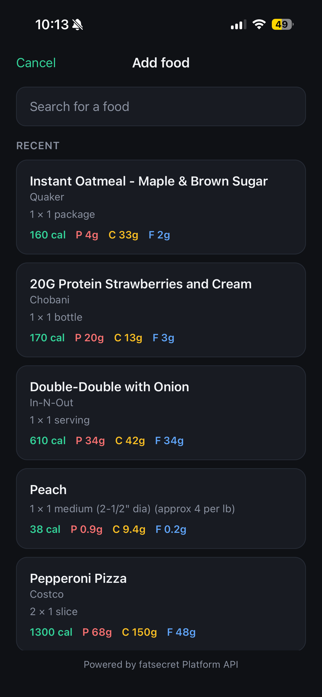

# MacroMonkey

A macronutrient and calorie tracking app for iOS. Search a nutrition database or scan a barcode, log what you ate to a meal, and see how the day adds up against your calorie and macro goals.

Live on the App Store: https://apps.apple.com/app/6813667153

Built with React Native, Expo, TypeScript, and Firebase.

---

## Screenshots

<p float="left">
  
  
  
  
</p>
-->

---

## Features

**Logging**
- Food search against the FatSecret Platform API, with autocomplete suggestions
- Barcode scanning for packaged foods
- Recent foods, deduplicated and newest-first, so repeat meals are one tap
- Meals — breakfast, lunch, dinner, and snack — assigned automatically from the time of day and editable afterward
- Editable log times; changing the time moves the entry to the right meal
- Multiple servings per food (package, gram, cup, …) with an adjustable amount

**Goals**
- Daily calorie target, set manually or estimated with a built-in Mifflin-St Jeor calculator
- Macro split set as percentages, shown in both percent and grams
- Goals stay fixed unless the user changes them — they do not silently drift with logged weight

**Daily view**
- Animated calorie ring plus per-macro progress rings
- Week strip with dots marking days that have entries, and a full calendar picker
- Entries grouped by meal, each with its own calorie subtotal and quick-add button

**Full breakdown**
- Macro split as a bullet chart: the bar is the share of calories actually eaten, the tick is the target split
- Per-meal contribution — how much of each goal every meal used
- Biggest contributors, ranked by calories
- Micronutrient totals (fiber, sugar, sodium, cholesterol, and more), with foods that don't report a nutrient excluded and marked rather than counted as zero

**Weight**
- Log a weight for any date, not just today
- Trend chart: raw weigh-ins as points, a 7-day moving average as the line
- Latest weight, 7-day average, and change over the window

**Account**
- Email/password sign-in, session persisted across launches
- In-app account deletion that removes diary entries, profile, and weights before deleting the identity

---

## Tech stack

| Layer | Choice |
|---|---|
| App | React Native via Expo (SDK 54), TypeScript |
| Navigation | Expo Router (file-based), typed routes |
| Animation | React Native Reanimated |
| Auth | Firebase Authentication (email/password) |
| Database | Cloud Firestore |
| Backend | Firebase Cloud Functions (2nd gen, Node/TypeScript) |
| Secrets | Google Secret Manager |
| Nutrition data | FatSecret Platform API |
| Builds | EAS Build, TestFlight, App Store |

---

## Architecture

### The credential proxy

The app never holds FatSecret credentials.

An early version put the API client ID and secret in the app's environment. That's a real exposure: anything bundled into a mobile app ships to every device and can be extracted from the binary, so `EXPO_PUBLIC_` variables are public in the literal sense. Anyone who pulled them could spend the API quota.

The credentials now live in Google Secret Manager and are read only inside a Cloud Function:

```
App  ──httpsCallable("fatsecret")──▶  Cloud Function  ──OAuth2──▶  FatSecret API
                                            │
                                            └── Secret Manager (client id + secret)
```

Three properties matter:

- **Authentication.** The function rejects unauthenticated calls, so the proxy is not an open endpoint for anyone who finds its URL.
- **Server-side URL construction.** The client sends an action and its arguments — `{ action: "search", query: "oatmeal" }` — never a URL. The function builds every upstream URL itself from module constants. If the client could supply a URL, an authenticated proxy would become an open relay.
- **Sanitized errors.** Upstream failures are logged server-side with detail and returned to the client as a generic message, so API internals don't leak through the trust boundary.

The OAuth2 access token is cached at module scope, which survives warm invocations, so repeated lookups don't each pay for a token exchange.

### Data model

Everything is namespaced under the signed-in user's `uid`, and Firestore security rules key on that `uid`, so one user can never read another's data.

**`users/{uid}/entries/{autoId}`** — one document per logged food.

| Field | Type | Notes |
|---|---|---|
| `date` | string | `YYYY-MM-DD`, the day this food counts toward |
| `loggedAt` | string | ISO timestamp, used for ordering |
| `meal` | string | `breakfast`, `lunch`, `dinner`, or `snack` |
| `foodId` | string | FatSecret food id |
| `name`, `brand` | string | copied in so the diary renders without a lookup |
| `serving` | object | the full chosen serving, macros and micronutrients included |
| `amount` | number | how many of that serving |

The serving is stored **denormalized** — the entire nutrition object is copied into the entry rather than referenced by id. That's deliberate. A diary is a historical record, so if the upstream database later revises a food's numbers, past days shouldn't silently change underneath the user. It also means the day view renders with no network calls at all.

Day queries use `where("date", "==", key)` and sort in memory by `loggedAt`, which keeps Firestore on an automatic single-field index instead of requiring a composite one.

**`users/{uid}/weights/{YYYY-MM-DD}`** — the date key *is* the document id.

That turns a save into an upsert via `setDoc`: one weigh-in per day, no duplicate detection, no read-before-write. Document ids also sort chronologically for free, so ordering by date needs no extra index. The 7-day average is computed client-side by walking backward from each point until the date key falls outside the window — string comparison on `YYYY-MM-DD` rather than millisecond arithmetic, which sidesteps daylight-saving edge cases.

**Profile** — calorie goal and macro split percentages, stored per user, and removed along with entries and weights when an account is deleted.

### Provider abstraction

`lib/foodApi.ts` converts FatSecret's response shapes into app-owned `Food` and `Serving` types at a single boundary. Screens never touch the raw API shape, so swapping or adding a nutrition provider is a change in one file.

That boundary also fixes upstream quirks in one place — FatSecret can reuse a `serving_id` within a single food, which caused both duplicate React keys and, more seriously, the wrong serving being selected. Serving IDs are made unique during conversion.

---

## Getting started

### Prerequisites

- Node.js and npm
- An Expo account (for EAS builds)
- A Firebase project on the Blaze plan (Cloud Functions require it)
- FatSecret Platform API credentials

### Setup

```bash
git clone https://github.com/joshuanunez75/MacroMonkey.git
cd MacroMonkey
npm install
```

Create `.env` in the project root with your Firebase web config:

```
EXPO_PUBLIC_FIREBASE_API_KEY=...
EXPO_PUBLIC_FIREBASE_AUTH_DOMAIN=...
EXPO_PUBLIC_FIREBASE_PROJECT_ID=...
EXPO_PUBLIC_FIREBASE_STORAGE_BUCKET=...
EXPO_PUBLIC_FIREBASE_MESSAGING_SENDER_ID=...
EXPO_PUBLIC_FIREBASE_APP_ID=...
```

The Firebase web config is a public identifier, not a secret — it's meant to ship in the client, and access control comes from Auth plus Firestore security rules. FatSecret credentials are different and must never go in `.env`.

### Deploying the function

Set the FatSecret credentials as secrets. Type them at the prompt; don't paste them into a file:

```bash
cd functions
npm install
firebase functions:secrets:set FATSECRET_CLIENT_ID
firebase functions:secrets:set FATSECRET_CLIENT_SECRET
firebase deploy --only functions
```

### Running the app

```bash
npx expo start
```

Open it in Expo Go, or build a development client with EAS. Barcode scanning needs a real device.

---

## Known limitations

These are deliberate MVP shortcuts, not oversights:

- **No offline indicator.** If Firestore can't reach the backend, an empty day is indistinguishable from a genuinely empty day, which risks double-logging. A cached-state banner would fix it.
- **No saved meals or recipes.** Multi-ingredient meals are re-logged item by item.
- **Calorie goal is manual.** It doesn't adapt to logged weight. That's intentional — a drifting target is hard to reason about — but an optional "suggest an adjustment" prompt would be a reasonable addition.
- **Weight is pounds only.** No kilograms, no unit preference.
- **Micronutrient coverage is uneven.** FatSecret doesn't report every nutrient for every food. Starred totals count only the foods that do report it, which is honest but means the number is a floor, not a total.
- **Single-device assumption.** Data syncs through Firestore, so it works across devices, but there's no conflict handling for simultaneous edits.

---

## Roadmap

- **Natural-language logging.** Describe a meal in plain English and have it resolved against real database entries, with a confirmation step before anything is logged. Parsing is grounded in the nutrition database rather than generated, so numbers come from real food records.
- **Saved meals and recipes.** Log a repeated combination in one tap.
- **Restaurant shortcuts** for chains that get logged often.
- **Offline indicator** so a stale view is visibly stale.

---

## License

## License

Copyright © 2026 Joshua Nunez. All rights reserved.

This repository is public so the code can be read and reviewed. It is not
licensed for reuse, redistribution, or derivative works.

## Attribution

Nutrition data powered by the [FatSecret Platform API](https://platform.fatsecret.com/).
